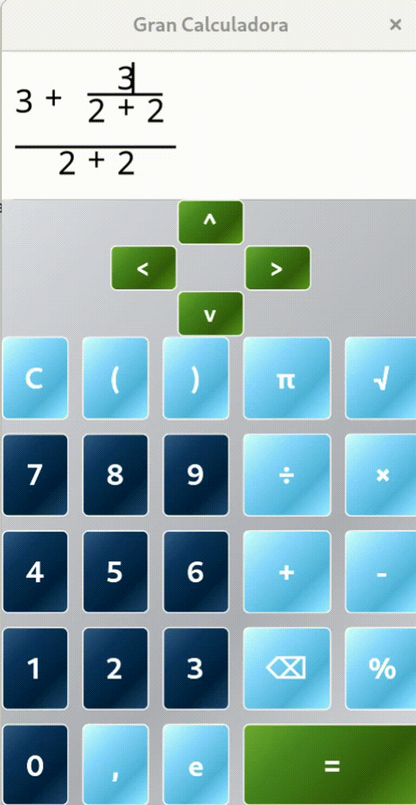

# Gran Calculadora (Great Calculator)

> **Status**: Development almost finished (~80% complete). Once finished, no further updates are planned in the near future.

Graphic calculator built with **GTKmm4**, **Cairo** and **C++** that supports fractions and powers in a more visual mode.

## Status

Core functionality is complete (fractions, powers, evaluation, navigation). Only testing and minor UI polish remain.
This is a demonstration project for job applications. No future updates are planned. Basic testing will be performed, but exhaustive testing is not planned.

## What's pending

- Expression evaluation
- Keyboard input
- Tests in Windows and Linux.

## Technologies

- **C++17** (smart pointers, modern features)
- **GTK4 / GTKmm** (GUI framework)
- **Cairo** (2D graphics)
- **Autoconf** (build system)

## License

MIT - see COPYING

## Author

Álex Jiménez <ajimenezba@edu.tecnocampus.cat>
