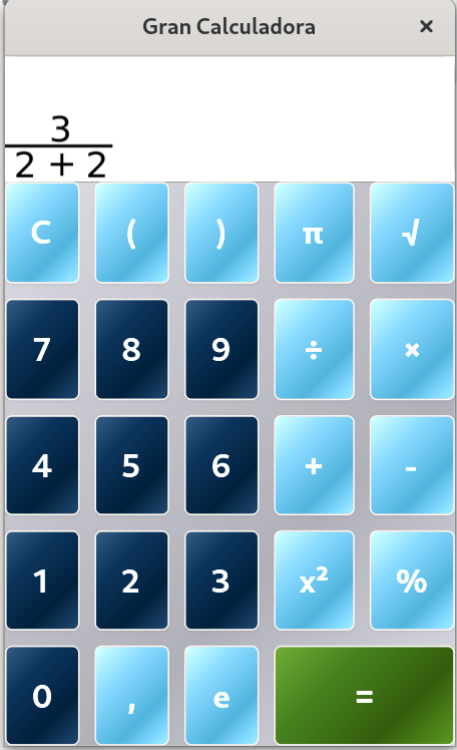

# Gran Calculadora (Great Calculator)

> **Status**: Early development (~15% complete)  
> GUI is done, but in the future maybe more buttons are added (sin, cos, tan, etc.). Now the development is focused on the calculator display screen.

Graphic calculator built with **GTKmm4**, **Cairo** and **C++** that supports fractions and roots in a more visual mode.

## What have been done

The calculator is still in its initial development. The GUI is totally built, but some changes maybe will be done in the future.

The development is centered now in the display rendering.

## What's pending

- Finish the display system
- Expression evaluation
- Keyboard input
- Advanced functions as trigonometric functions or equation solver.
- Tests
  
## Technologies

- **C++17** (smart pointers, modern features)
- **GTK4 / GTKmm** (GUI framework)
- **Cairo** (2D graphics)
- **Autoconf** (build system)

## License
MIT - see COPYING

## Author
Álex Jiménez <ajimenezba@edu.tecnocampus.cat>
